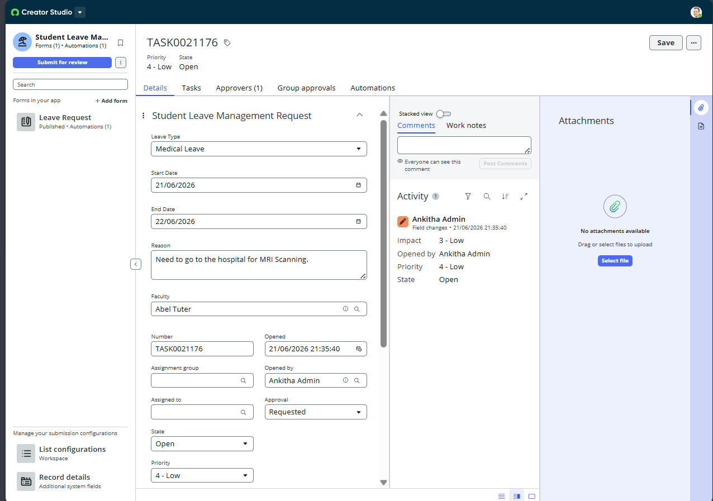
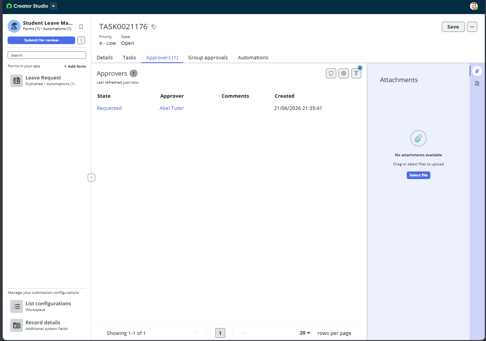

# Student Leave Management Application

## 📋 Project Overview
An automated, low-code application built on the ServiceNow platform (Creator Studio) designed to digitize and streamline the entire lifecycle of student leave requests. This application replaces manual, fragmented tracking with an event-driven system that manages requests from intake to faculty approval and real-time status updates.

## ✨ Key Features
* **Custom Intake Form (Record Producer):** Captures multi-type leave details (Medical, Academic, Personal), dates, and dynamically assigns a verifying faculty member.
* **Automated Playbook Engine:** Orchestrates back-end business logic instantly upon form submission without manual intervention.
* **Dynamic Approval Routing:** Automatically generates an approval task mapped directly to the designated faculty reviewer, transitioning states dynamically (`Requested` ➔ `Approved`).
* **Agent Workspace Interface:** Centralizes tracking records (e.g., `TASK0020872`) for administrative oversight and audit logging.

## 🛠️ Architecture & Tech Stack
* **Platform:** ServiceNow (Creator Studio / Xanadu release)
* **Process Automation:** Playbook Designer / Flow Architecture
* **Data Modeling & Security:** Custom scoping, Table Configurations, and Access Control Lists (ACLs).
* **UI/UX:** Configurable Workspace Views & Record Forms.

## 🖼️ Application Interface

### 1. Student Leave Request Form (Intake Portal)

### 2. Creator Studio Workspace View

### 3. Automated Approval Routing Lifecycle

## ⚙️ How to Import This Project
To view or test this application in your own ServiceNow Personal Developer Instance (PDI):
1. Download the `.xml` update set file from this repository.
2. In your ServiceNow instance, navigate to **Retrieved Update Sets**.
3. Click **Import Update Set from XML** and upload the file.
4. Open the retrieved record, click **Preview Update Set**, and then click **Commit Update Set**.
